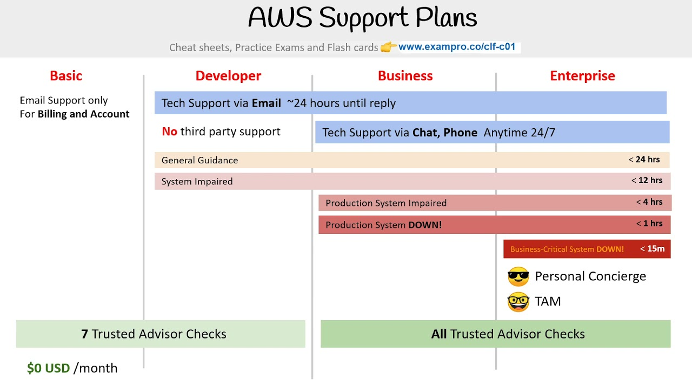

# AWS Certified Cloud Practitioner

Here you will find a lot of key information that will help you when studying for the Amazon Certified Cloud Practitioner Exam.

You can also visit here to view the AWS Service Directory.

Firstly, it is important to note that the fundamentals of cloud architecture will be on the exam, so I would suggest reading the information on the previous page so that you are fully up to grips with `The Cloud`.

## AWS Support

AWS have a tool called `AWS Trusted Advisor` that us used for checking your AWS usage against best practices. The AWS Trusted Advisor provides recommendations in the following 5 categories:
- Cost Optimisation
- Performance
- Security
- Fault Tolerance
- Service Limits

AWS has 4 different support plans available to consumers:
- Basic (Free)
- Developer (29$ a month min.)
- Business (100$ a month min.)
- Enterprise ($15,000 a month min.)

The below diagram shows what you can expect from each plan.

