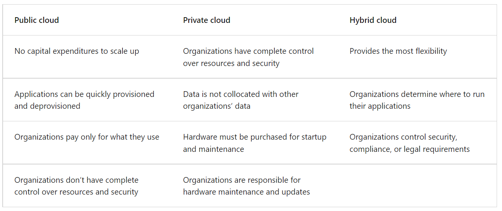

# The Cloud

Cloud computing is the delivery of computing services over the internet. Computing services include common IT infrastructure such as Virtual Machines, Storage, Databases, and Networking.

Because cloud computing uses the internet to deliver these services, it doesn't have to be constrained by physcial infrastructure the same way that a traditional datacenter is. That means if you need to increase your IT infrastructure rapidly, you don't have to wait to build a new datacentre - you can use the cloud to rapdily expand your IT footprint.

## The Benefits of Cloud Computing

## Define Cloud Models

This is the varying ways in which cloud resources can be deployed.

>Public Cloud - Deployed onto a public cloud provider like AWS, MIcroosft Azure and the Google Cloud Platform.

>Private Cloud - Deployed in a private datacentre using a cloud-like platform provided by vendors like VMWare.

>Hybrid Cloud - Deployed with a mix of the previous two options.

The table below highlights a few key comparative aspects between the cloud models.

## The Shared Responsibility Model

This model dictates what responsibilities are shared between which parties (whether it is the responsibility of the cloud provider or the consumer).

As depicted, the consumer will always be responsible for:
- The information and data stored in the cloud
- Devices that are allowed to connect to your cloud
- The accounts and identities pf the people, services, and devices within your organisation

The cloud provider is always repsonsible for:
- The physical datacenter
- The physical hosts
- The physcial network

Your service model will determine respponsibility for things like:
- Opearting systems
- Network controls
- Identity and infrastructure